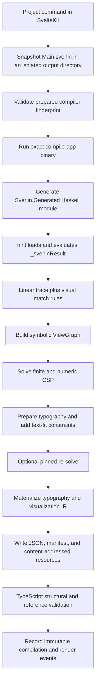

# Compile Haskell interface audit

## Status and purpose

This document describes the restored compiler implementation at commit
`dc018bb` (`181a53d` plus the restoration/archive documentation). It answers
four practical questions:

1. How does authored Sverlin source travel from the Svelte application to a
   rendered visualization?
2. Which Haskell modules and interfaces are actually used?
3. Which boundaries are useful, and which exports or layers look incomplete,
   legacy, duplicated, or premature?
4. What is the smallest sensible route toward a verbose, flexible, and
   unambiguous initial DSL?

This is an audit, not an API change. A name being absent from the current
example does not make it dead. In particular, the example suite is much too
small to use as the sole basis for deleting visual expressivity.

The post-`181a53d` implementations remain useful evidence, but are not treated
as the current design. See `POST_181_REFACTOR_INDEX.md` for their feature and
failure history.

## Terms used in this document

- **Authored source** means a body-only `.sverlin` file. It cannot add its own
  module header or imports.
- **Author-visible** means a name brought into that generated module by its
  fixed imports. This is the effective DSL surface.
- **Package-exposed** means a module listed under `exposed-modules` in Cabal.
  Executables, tests, and other Haskell packages can import it. Package exposure
  is broader than author visibility.
- **Host** means the trusted compiler executable: source loading, graph
  construction, solving, typography, output writing, and diagnostics.
- **IR** means the concrete JSON-shaped visualization data handed to the
  Svelte application after all compiler decisions have been made.
- **CSP** means the finite choices and numeric constraints used to produce
  different valid visual solutions. It is the compiler's design search space.

## Executive findings

The compiler is not a collection of unused modules. Every current module under
`compile/src` is reachable through the import graph. The main architectural
stages are also meaningful:

1. `LinearTrace.Core` records linear semantic lifetimes.
2. `LinearTrace.Choreography.*` turns author declarations into semantic matches
   and visual rules.
3. `LinearTrace.View.*` holds and validates the symbolic visual graph.
4. `Solver.*` compiles and samples the visual design space.
5. `LinearTrace.Visualization.*` shapes text, produces concrete IR, and packages
   resources.

Names such as `Box`, `Graph`, and `Style` repeat across stages because the data
is progressively transformed. They are not simple duplicate implementations.
Flattening these stages would make validity harder to reason about.

The main problems are at the edges:

- The one author facade also exports host-only graph construction, solving,
  statistics, and runner operations. Those names are consequently included in
  the AI-facing API index.
- The facade exposes `SlotHandle`, `Observe`, `Seal`, and `Unseal`, but not the
  corresponding `observe`, `seal`, and `unseal` operations. This is an
  incomplete public lifecycle, not a usable Slot API.
- Many useful-looking author names are tested only through direct Haskell
  fixtures. Only `examples/Minimal.sverlin`, containing two empty declarations,
  currently crosses the complete body-only source boundary.
- Compiler preparation runs Cabal once and records a source-fingerprinted direct
  executable plus its GHC environment. Web and manual compilation then execute
  that exact binary, so concurrent projects do not build in the shared Cabal
  directory.
- Generated TypeScript declarations, handwritten runtime schemas, the Haskell
  package manifest, the TypeScript manifest schema, and the recorded DSL
  fingerprint do not share one complete source of truth.
- Several clearly historical or speculative paths remain: typography-free IR
  compilation used by tests, legacy IR variants, an empty resource-package
  helper, and a general output-target layer with only one target.

The recommended direction is a small `Sverlin` author facade, a narrow generated
runner seam, and a separate compiler facade. The existing Block, CSP,
typography, code-rendering, style-profile, and lineage behavior should be
preserved while this boundary is introduced.

## End-to-end plumbing

### Overview



### High-level code path

The following shortened excerpts show how the boxes above connect in the
current implementation. They omit validation branches and event payload fields,
but retain the real function and data flow.

#### Browser: submit a project command

The visualization toolbar ultimately calls `ProjectSession.runCommand`. The
browser sends the command together with a new operation ID and the Timeline head
it expects to update. When the request completes, it replaces its local resource
with the complete server-validated response.

```ts
// src/lib/client/projects/project-session.svelte.ts
async runCommand(input: ProjectCommandInput): Promise<boolean> {
  const operationId = crypto.randomUUID();

  const response = await fetch(`/api/projects/${encodeURIComponent(this.projectId)}`, {
    method: 'POST',
    headers: { 'content-type': 'application/json' },
    body: JSON.stringify({
      ...input,
      operationId,
      expectedHead: this.head
    })
  });

  this.#resource = parseProjectResource(await response.json());
  return true;
}

// One caller: regenerate the current visualization with a selected seed.
await session.runCommand({ type: 'render', seed });
```

#### SvelteKit route: validate and dispatch

The route parses the discriminated command, dispatches it to the corresponding
project operation, waits for that operation to finish, and returns the complete
project resource rather than a second partial representation.

```ts
// src/routes/api/projects/[projectId]/+server.ts
export const POST: RequestHandler = async ({ params, request }) => {
  const command = parseProjectCommand(await request.json());
  await runCommand(params.projectId, command);
  return json(await loadProjectResource(params.projectId));
};

function runCommand(projectId: string, command: ProjectCommand) {
  const common = {
    projectId,
    expectedHead: command.expectedHead,
    operationId: command.operationId
  };

  switch (command.type) {
    case 'render':
      return renderProject({ ...common, seed: command.seed });
    case 'save':
      return updateProjectArtifact({
        ...common,
        artifactId: command.artifactId,
        source: command.source,
        seed: command.seed
      });
    // rename, feedback, and restore follow the same boundary.
  }
}
```

#### Project service: snapshot, record, and compile

The service derives the current source from the immutable Timeline. It records
`compilation.requested` before invoking the compiler, records either success or
failure afterward, and only activates a render after successful compilation.

```ts
// src/lib/server/projects/service.ts
async function renderDocument(document, seed, purpose, operationId) {
  const snapshot = projectSnapshotAt(document);
  const artifact = snapshot.artifacts[snapshot.entryArtifactId];

  const recorded = await compileProjectSource({
    document,
    sourceContent: artifact.content.text,
    source: artifact.content,
    sourceLabel: artifact.path,
    seed,
    purpose,
    input: 'committed-artifact',
    operationId
  });

  return recorded.result.ok ? activateCompiledRender(recorded) : recorded.document;
}

export async function compileProjectSource(options) {
  const request = draftEvent<'compilation.requested'>({
    type: 'compilation.requested',
    actor: { kind: 'system' },
    operationId: options.operationId,
    payload: {
      purpose: options.purpose,
      input: options.input,
      source: options.source,
      sourceLabel: options.sourceLabel,
      seed: options.seed
    }
  });
  const document = await appendProjectEvents(options.document, [request]);

  const result = await compileSource({
    sourceContent: options.sourceContent,
    sourceLabel: options.sourceLabel,
    seed: options.seed,
    owner: 'project'
  });

  return recordCompileResult({ ...options, document, result });
}
```

#### Compiler boundary: isolated source to validated visualization

`compileSource` writes the exact source snapshot, refuses a missing or stale
prepared compiler, runs the recorded binary, then validates the resulting JSON
and package attachments before returning success.

```ts
// src/lib/server/compiler/compile.ts
export async function compileSource({ sourceContent, sourceLabel, seed, owner }) {
  const { outputDir, outputPath } = await createCompileOutput({ owner, seed });
  const sourcePath = path.join(outputDir, 'source', 'Main.sverlin');
  await writeFile(sourcePath, sourceContent, 'utf8');

  const prepared = await readPreparedCompiler();
  const { command, args } = compileCommand(
    prepared.binaryPath,
    seed,
    outputPath,
    sourcePath,
    sourceLabel
  );

  const debug = await runCompile(command, args, process.cwd(), readCompileTimeoutMs(), {
    env: preparedCompilerEnvironment(prepared)
  });
  const compiledJson = await readFile(outputPath, 'utf8');
  const visualization = decodeVisualization(compiledJson);
  const bundle = await readCompileBundle(outputPath, compiledJson, visualization);

  return {
    ok: true,
    visualization,
    resources: bundle.resources,
    provenance: bundle.provenance,
    targetDiagnostics: bundle.targetDiagnostics,
    debug
  };
}
```

The binary represented by `command` performs the Haskell half of the flowchart:
body-only source generation, Hint/GHC loading, linear-trace execution, CSP
solving, typography, IR materialization, and package writing.

#### Browser return path: live events and final rendering

Committed stages are visible before the command response through the project's
server-sent event stream. The final HTTP response remains authoritative. Once a
new active render is present, the workspace decodes it, loads it into the
player, and passes the current materialized elements to the SVG viewport.

```ts
// src/lib/client/projects/project-session.svelte.ts
const source = new EventSource(
  `/api/projects/${encodeURIComponent(this.projectId)}/events?after=${this.head}`
);

source.addEventListener('project-event', (message) => {
  this.ingest(
    normalizeProjectEventV1(JSON.parse((message as MessageEvent<string>).data))
  );
});

get visualization(): Visualization | undefined {
  const render = this.#resource ? this.snapshot.activeRender : undefined;
  return render ? decodeVisualization(render.payload.render.text) : undefined;
}
```

```svelte
<!-- src/lib/client/projects/ProjectWorkspace.svelte -->
<script lang="ts">
  $effect(() => {
    const visualization = session.visualization;
    if (visualization) {
      player.setVisualization(visualization, { initialStep: 0 });
    }
  });
</script>

<VisualizationViewport
  elements={player.elements}
  root={player.canvasRoot!}
  width={player.canvasWidth}
  height={player.canvasHeight}
  resourceBaseUrl={`/api/projects/${encodeURIComponent(session.projectId)}/resources`}
/>
```

### 1. Project command and source snapshot

`src/lib/server/projects/service.ts` obtains the current entry artifact from the
project Timeline and calls `compileProjectSource`. It first records a
`compilation.requested` event containing the source hash, source label, seed,
purpose, and best-effort DSL revision.

`src/lib/server/compiler/compile.ts` then:

- creates a unique directory under `outputs/seed-<seed>/`;
- writes the exact candidate to `source/Main.sverlin`;
- retains the project-facing label, normally `Main.sverlin`, for diagnostics;
- invokes the compiler with a timeout and cancellation support;
- reads the resulting JSON and manifest;
- validates all resource paths, byte lengths, media types, and SHA-256 digests;
- passes the JSON through the production visualization decoder.

Whole commands are serialized per project by `command-lock.ts`. Different
projects are deliberately allowed to run at the same time.

### 2. Node and prepared-compiler boundary

`pnpm run prepare:compiler` is the only normal path that builds `compile-app`.
It fingerprints compiler-owned source, configuration, vendored code, fonts, and
native bridge inputs, then atomically records the executable and GHC package
environment under `.cache/sverlin/`. The descriptor is repository-bound because
its default root is the current checkout.

The Svelte server validates that descriptor and starts the recorded Haskell
executable directly. Its command is equivalent to:

```text
<prepared compile-app> \
  --source <isolated-source>
  --source-label Main.sverlin
  --output <isolated-output>
  --target ir-json
  --details
  --seed <seed>
```

`readPreparedCompiler` rejects missing, malformed, non-executable, and stale
descriptors before a project compile begins. `dev`, `build`, `preview`, and
adapter-node `start` prepare first. This removes the historical request-time
Cabal race without changing the source or output contracts.

There is also repeated process code:

- `scripts/run-cabal.mjs` owns Cabal environment setup and signal forwarding.
- `scripts/prepare-compiler.mjs` owns the explicit Cabal build and descriptor
  write; `scripts/run-compile.mjs` validates and executes the prepared binary.
- `src/lib/server/compiler/compile.ts` implements another process runner with
  timeouts and cancellation.
- `scripts/benchmark-compile.mjs` implements a similar timeout, capture, and
  process-group termination loop.

The prepared compiler is now the production boundary. Cabal remains a setup and
development tool rather than a per-request runtime dependency.

### 3. Body-only source generation

The current starting source is exactly:

```haskell
program :: Choreography ()
program = return ()

visualization :: VisualizationBuilder ()
visualization = return ()
```

`compile/app/Sverlin/Source.hs` places this body after a fixed declaration and
before a fixed footer. The generated module supplies language extensions and
imports, including `RebindableSyntax`, `LinearTrace.Choreography`, and the
linear Prelude. Its relevant footer is:

```haskell
_sverlinResult :: VisualTraceGraph
_sverlinResult =
  runChoreographyWithGenerativeStyles (visualize visualization) program
```

This footer is why runner and graph types currently appear in the author
facade: the generated module needs them. The authored body itself does not.

`Sverlin.Interpreter` writes the generated module to a temporary directory and
uses `hint` to interpret `_sverlinResult`. The input is trusted authoring code,
not a security sandbox.

### 4. Linear semantic trace

The current model uses an opaque `Block tag` as the live linear capability for
one semantic value. A `Pending tag` is not yet a live Block and must be resolved
by materialization or commit. Operations consume or return Blocks so the
program cannot silently retain an old live version.

This abridged example shows the intended lifecycle shape:

```haskell
data Item
type instance Payload Item = LInt Item

program :: Choreography ()
program = do
  Create pending <- create @Item (LInt 3)
  item <- materialize #item pending
  checkpoint "Created"

  Copy original pendingCopy <- copy item
  copied <- materialize (#item <&> #copy) pendingCopy
  checkpoint "Copied"

  Destroy <- destroy original
  Destroy <- destroy copied
  checkpoint "Removed"
  return ()
```

`copy` records a fork. `replace` records a continuation from an old Block to a
new Block. `destroy` closes the live capability. During IR compilation those
events become stable render-instance origins, which lets the client animate
continuations and forks instead of treating every checkpoint as unrelated.

The type system provides a strong ownership guarantee, but not a complete
semantic provenance proof. In particular, `use` consumes a Block and exposes
its payload through a one-use wrapper; arbitrary computation after that point
is not automatically represented as a trace operation. That limitation should
remain explicit rather than being hidden behind stronger claims.

- TODO rather than `Choreography`, the exposed trace monad should be `Program`,
  probably with a refactored internal structure to remove the current `Choreography`
  module or replace it.
- TODO what is involved in removing `use` or restricting it? does the current
  pattern encourage arbitrary `create` after `use`?
- TODO more comprehensive domain model to restrict `create` ?

### 5. Semantic-to-visual projection

Materialization attaches facts to immutable snapshots. Visual rules query those
facts, declare visual nodes, and add constraints. The trace program and visual
rules are built separately and joined when `buildViewGraph` replays trace
events.

```haskell
visualization :: VisualizationBuilder ()
visualization = do
  width (by 320)
  height (by 180)
  contentFit Both Contain
  Bound label <- bindContent
  Selected items <- select @Item (#item <&> payload label)
  node items $ do
    content label
    width (by 72)
    height (by 48)
  ensure $ left items .>=. at 24
  ensure $ right items .<=. at 296
  ensure $ top items .>=. at 24
  ensure $ bottom items .<=. at 156
```

A successful declaration may represent many matching snapshots. `RenderFresh`,
`RenderContinue`, `RenderFork`, and `RenderRemove` preserve their lifetime and
lineage across checkpoints.

### 6. View graph, solver, and typography

`LinearTrace.Choreography.Graph` replays the trace, applies matching visual
rules, and invokes `LinearTrace.View.Build`. The resulting `ViewGraph` contains
nodes, choices, hard constraints, soft preferences, and timeline steps.

`LinearTrace.View.Solve` uses a visualization-specific solve configuration. It
keeps direct solver defaults conservative while allowing visual regeneration to
avoid long optimizer tails. Affine bounded problems use the sampler; nonlinear
or unbounded cases can fall back to the penalty optimizer.

Typography is deliberately a compiler phase rather than browser guesswork:

1. Solve the initial visual graph.
2. Resolve fonts and shape candidate text using HarfBuzz.
3. Add exact fit constraints when text geometry requires them.
4. Re-solve with the earlier solution pinned where appropriate.
5. Materialize lines, glyph-run resources, highlights, and findings.

This two-solve path is real work, not duplicate decoration logic. Removing it
in the later refactor materially reduced output quality.

- TODO could text width/height be expressed as linear/affine constraints directly,
  thus allowing for solving in one pass?
- TODO it would make sense that a node with text has pre-defined minimum and
  width and height based on affine text width/height constraints. is this the
  ideal model?

### 7. IR, resources, and Svelte validation

`LinearTrace.Visualization.Compile` turns the solved graph and typography output
into `LinearTrace.Visualization.IR.Visualization`. The result contains concrete
boxes and styles, CSP provenance, resource descriptors, findings, and timeline
instances.

`Resource` collects content-addressed bytes. `Target` currently has one target,
`IrJson`, which encodes either one visualization or a batch and constructs a
manifest. `Main` writes:

- the requested JSON file;
- `<output>.manifest.json`;
- content-addressed attachments below `resources/`.

The Svelte server validates the JSON structure, graph references, text ranges,
resource descriptors, manifest, and bytes before a successful compilation can
be activated. A failure is recorded as `compilation.failed`; a success is
recorded as `compilation.succeeded` and only then promoted through
`visualization.rendered`.

- TODO how do content-addressed attachments work? why are these separated?
  what is their purpose?
- TODO how is the IR currently documented for consumer services, e.g. the front end?
  is the structure of the IR clearly documented and/or automatically generatable?

## Interface inventory

### Public and technical exposure

The Cabal library exposes nine modules:

| Module                                 | Effective role                     | Current external consumers                  | Assessment                                  |
| -------------------------------------- | ---------------------------------- | ------------------------------------------- | ------------------------------------------- |
| `LinearTrace.Choreography`             | Author facade plus host operations | Generated source, compiler app, tests       | Split author and host responsibilities.     |
| `LinearTrace.Core`                     | Core trace facade                  | Choreography internals and tests            | Useful internal seam; not an authored DSL.  |
| `Solver`                               | Stable solver facade               | View layers, app, tests, benchmark          | Keep; audit convenience exports separately. |
| `LinearTrace.Visualization.Compile`    | Solved graph to IR                 | App and tests                               | Host-only.                                  |
| `LinearTrace.Visualization.IR`         | Haskell wire contract              | App, generator, visualization layers, tests | Keep explicitly exposed as a contract.      |
| `LinearTrace.Visualization.Options`    | Shared JSON naming                 | IR and TS generator                         | Generator support, not general public API.  |
| `LinearTrace.Visualization.Resource`   | Resource package                   | App and visualization layers                | Host-only contract.                         |
| `LinearTrace.Visualization.Target`     | Output encoding and manifest       | App only                                    | Prematurely general with one target.        |
| `LinearTrace.Visualization.Typography` | Text preparation/materialization   | App, IR compiler, tests                     | Host-only and essential.                    |

Some exposure exists because Cabal executables and test suites depend on the
library and may import only exposed modules. That technical constraint should
not be confused with a stable author API. A private Cabal sublibrary could
enforce the distinction later, but introducing one before the logical facades
are clean would add structure without reducing current authoring risk. The
fixed generated imports already control the effective body-only source surface.

### Author and choreography modules

| Module                                | What it does                                                                             | Used by                      | Assessment                                                                                          |
| ------------------------------------- | ---------------------------------------------------------------------------------------- | ---------------------------- | --------------------------------------------------------------------------------------------------- |
| `LinearTrace.Choreography`            | Re-exports 208 documented names and adapts query materialization                         | Generated source, app, tests | Keep as compatibility during migration; it currently mixes author and host APIs.                    |
| `LinearTrace.Choreography.Box`        | Author padding, margin, and fit commands                                                 | Facade                       | Keep internal. It adapts author commands to view templates.                                         |
| `LinearTrace.Choreography.Constraint` | Author hard/soft relations and alternatives                                              | Facade                       | Keep internal; later make public spellings less overloaded.                                         |
| `LinearTrace.Choreography.Graph`      | Joins trace events and visual rules; solves graphs                                       | Facade                       | Move behind runner/compiler facades.                                                                |
| `LinearTrace.Choreography.Layout`     | Typed positions, spans, offsets, arithmetic, and accessors                               | Facade, Variable             | Keep capability; review overloaded syntax.                                                          |
| `LinearTrace.Choreography.Match`      | Stores rules, matches queries, validates selections, lowers constraints/styles/hierarchy | Five choreography modules    | Keep, but it combines several responsibilities in 1,300+ lines. Split only alongside focused tests. |
| `LinearTrace.Choreography.Node`       | Selections, generated parents, content, code content, canvas operations                  | Six choreography modules     | Keep expressivity; later separate overloaded node/selection cases.                                  |
| `LinearTrace.Choreography.Style`      | Author style assignment, style choice, cascade access                                    | Facade                       | Keep internal adapter.                                                                              |
| `LinearTrace.Choreography.Variable`   | Bound query values and reusable solver values                                            | Facade                       | Keep; `variableFrom` lacks current consumer evidence.                                               |

The facade's first section is the clearest boundary error. The authored body
needs `Choreography` and `VisualizationBuilder`; the host needs
`VisualTraceGraph`, `ViewGraph`, graph building, solving, statistics, and the
three runner variants. Publishing all of them together makes the API index both
larger and less clear.

The generated index also exposes implementation-shaped constraints such as
`VariableValue`, `BoundsExpr`, `VisualConstraint`, `AddExpr`,
`IntegerLiteral`, `StyleField`, `RelateValues`, and bridge helper classes in
otherwise public signatures. Some are legitimate type-inference machinery, but
they make explicit author signatures and compiler errors difficult to
understand because the supporting names are not themselves documented as DSL
concepts.

### Linear trace modules

| Module                      | What it does                                                                  | Used by                            | Assessment                                                                                           |
| --------------------------- | ----------------------------------------------------------------------------- | ---------------------------------- | ---------------------------------------------------------------------------------------------------- |
| `LinearTrace.Core`          | Curated trace/query facade                                                    | Six choreography modules and tests | Keep as an implementation facade; remove package exposure only after tests have an intentional seam. |
| `LinearTrace.Core.Internal` | Block representation, linear builder, events, operations, Slot implementation | Core and Query                     | Keep hidden. This owns the important lifetime invariant.                                             |
| `LinearTrace.Core.Query`    | Facts, payload patterns, matching, and query bindings                         | Core                               | Keep separate: it is unrestricted matching over immutable snapshots, not live ownership.             |

The core contains a real but inaccessible Slot model:

```haskell
seal   :: Block owner %1 -> Block tag %1 -> TraceBuilder (Seal owner tag)
unseal :: Block owner %1 -> Slot owner tag %1 -> TraceBuilder (Unseal owner tag)
```

The Slot constructor is intentionally hidden so a child Block cannot be
extracted without `unseal`. This is useful ownership behavior. The current
author facade, however, exports only the alias and result constructors. The
right choices are to expose and test a complete lifecycle or temporarily remove
all author-facing Slot names. Keeping half of it is misleading.

`observe` has the same problem: the result wrapper is public but the operation
is not. No current authoring guide or end-to-end example explains it.

### View modules

| Module                          | What it does                                                         | Used by                           | Assessment                                                                 |
| ------------------------------- | -------------------------------------------------------------------- | --------------------------------- | -------------------------------------------------------------------------- |
| `LinearTrace.View.Access`       | Reads layout/style values from selected nodes                        | Choreography adapters             | Keep internal.                                                             |
| `LinearTrace.View.Box`          | Stores node boxes and emits box-model constraints                    | View, choreography, visualization | Keep. It is the symbolic box stage, not a duplicate of `Choreography.Box`. |
| `LinearTrace.View.Build`        | Finalizes nodes, constraints, choices, hierarchy, and render intents | Graph and Match                   | Keep; central validity boundary.                                           |
| `LinearTrace.View.Graph`        | Symbolic graph, nodes, content, hierarchy, and timeline data         | Most view/visualization modules   | Keep as the internal shared model.                                         |
| `LinearTrace.View.Primitives`   | Typed expression aliases and geometry/colour helpers                 | Fifteen internal modules          | Keep; widely shared low-level vocabulary.                                  |
| `LinearTrace.View.Solve`        | Tuned visual solve and legacy fallback dispatch                      | Choreography.Graph                | Keep host-only.                                                            |
| `LinearTrace.View.Style`        | Complete typed style plans and solver-backed style fields            | Eleven internal modules           | Keep. Large, but it centralizes field semantics and cascade data.          |
| `LinearTrace.View.StyleProfile` | Seeded coherent automatic styles                                     | Choreography.Graph                | Keep. This provides compiler-owned polish and variation.                   |
| `LinearTrace.View.Template`     | Accumulates one node declaration before matching/building            | Five choreography modules         | Keep. It replaced the narrower old Patch structure.                        |

`View.Patch` was removed in `0ff53cc`; its responsibilities were expanded into
`View.Template` and the matching/build path. There is no remaining parallel
Patch module to delete.

- TODO how are style profiles currently defined? how does one add a profile
  and configure it?
- TODO double check removal of patch did not negatively affect automatic
  animatable transitions for blocks with shared lineages

### Visualization modules

| Module                                    | What it does                                                               | Used by                                | Assessment                                                                                                   |
| ----------------------------------------- | -------------------------------------------------------------------------- | -------------------------------------- | ------------------------------------------------------------------------------------------------------------ |
| `LinearTrace.Visualization.CodeHighlight` | Converts supported source languages into semantic tokens                   | Typography                             | Keep.                                                                                                        |
| `LinearTrace.Visualization.Compile`       | Produces concrete elements, timeline instances, lineage, and findings      | App and tests                          | Keep host-only; migrate tests away from typography-free `compileSolved`.                                     |
| `LinearTrace.Visualization.FontCatalog`   | Resolves bundled font faces and resources                                  | Typography                             | Keep.                                                                                                        |
| `LinearTrace.Visualization.HarfBuzz`      | Native shaping boundary                                                    | Typography                             | Keep; narrow and cohesive.                                                                                   |
| `LinearTrace.Visualization.IR`            | Canonical concrete visualization types and JSON instances                  | Producer, generator, consumer boundary | Keep as the wire source of truth.                                                                            |
| `LinearTrace.Visualization.Options`       | Aeson and TypeScript field/constructor naming                              | IR and generator                       | Keep beside generation; do not duplicate naming maps.                                                        |
| `LinearTrace.Visualization.Resource`      | Resource bytes, descriptors, provenance, deduplication                     | Typography, target, app, tests         | Keep; remove `emptyCompilationPackage` if a final consumer search remains empty.                             |
| `LinearTrace.Visualization.Target`        | Encodes IR JSON and manifest artifacts                                     | Main only                              | Reconsider until a second target exists. Resource packaging is needed; target polymorphism currently is not. |
| `LinearTrace.Visualization.Typography`    | Font selection, shaping, line candidates, fit constraints, materialization | App, compiler, tests                   | Keep. Consider smaller internal sections only when changing it, not as a standalone cleanup.                 |

`compileSolved` bypasses managed typography and emits `LegacyTextContent`. It is
used by solver tests, while production always calls
`compileSolvedWithTypography`. This makes tests easier but preserves a second
IR path that production does not use. Tests should be migrated to small
production-shaped typography fixtures before removing it.

`LegacyTextContent`, `LegacyOptimizer`, and `LegacyCoverage` are still accepted
by Haskell IR, the TypeScript schema, the renderer, and tests. `LegacyOptimizer`
is not purely dead because nonlinear/unbounded solve fallback remains real.
`LegacyTextContent` is a stronger retirement candidate once all tests build
managed text.

`Target` currently models requests, target diagnostics, artifacts, bundles, and
errors for one `IrJson` constructor. Its diagnostics list is always empty.
Future SVG, LaTeX, or PDF output is only a README promise. The manifest and
resource validation are valuable, but they do not require pretending that
multiple targets already exist.

### Solver modules

| Module               | What it does                                                                  | Used by                             | Assessment                       |
| -------------------- | ----------------------------------------------------------------------------- | ----------------------------------- | -------------------------------- |
| `Solver`             | Top-level opaque expression, choice, problem, sampling, and inspection facade | 24 app/internal/test modules        | Keep as the intended solver API. |
| `Solver.Affine`      | Extracts and reduces affine constraints                                       | DesignSpace, HiGHS, Problem, Sample | Keep internal.                   |
| `Solver.Categorical` | Enumerates/samples finite categorical components                              | DesignSpace and Problem             | Keep internal.                   |
| `Solver.Choice`      | Typed finite choices and choice constraints                                   | Facade and solver internals         | Keep internal.                   |
| `Solver.Constraint`  | Numeric/choice constraints, alternatives, component relations                 | Facade and solver internals         | Keep internal.                   |
| `Solver.DesignSpace` | Compiles and samples finite affine design spaces                              | Facade                              | Keep.                            |
| `Solver.Expr`        | Opaque symbolic expression implementation                                     | Facade and solver internals         | Keep internal.                   |
| `Solver.Highs`       | MIP-backed conditioned decision solving                                       | DesignSpace                         | Keep internal.                   |
| `Solver.Optimize`    | Penalty objective and nonlinear optimizer adapter                             | Problem                             | Keep as fallback.                |
| `Solver.Problem`     | Problem compilation, preprocessing, solve config, results, inspection         | Facade and solver internals         | Keep; large but central.         |
| `Solver.Random`      | Seeded generator helper                                                       | Five solver modules                 | Keep internal.                   |
| `Solver.Sample`      | Affine hit-and-run sampling and volume estimates                              | DesignSpace and Problem             | Keep internal.                   |

The top-level solver facade has 137 exports. Many inspection and configuration
functions are test/benchmark-facing by design, so their absence from production
code is not evidence of staleness. There are nevertheless likely redundant
convenience spellings: the old `@+@`, `@-@`, `@*@`, `@/@`, and `@^@` operators
coexist with numeric instances; several direct comparison operators and domain
accessors have no external consumer. These should be audited as a solver API
task, not deleted during the author-facade split.

- TODO create a unified solver API deprecating old APIs; as part of this,
  we need to check whether there are legacy operators in other layers, and decide
  which operators are available to .sverlin defs
- TODO need to confirm solver architecture. my understanding is that DesignSpace
  solves non-convex constaints to produce an affine constraint system. this can
  then be solved linearly? in theory, would it be possible to encode affine
  constraints in the DSL with valid domains for variables such that a front-end
  is able to visualise these, e.g. a "gap" variable between pairs of elements
  can all render to a red line between those?
- TODO are there current examples of non-affine constraints, or possible examples
  that can test the soft constraint layer?

### Executables, generators, tests, and fixtures

| Module                                  | What it does                                                                                            | Assessment                                                                                                  |
| --------------------------------------- | ------------------------------------------------------------------------------------------------------- | ----------------------------------------------------------------------------------------------------------- |
| `compile/app/Main.hs`                   | CLI parsing, interpretation, graph build, both solve phases, typography, packaging, timing, and writing | Too much host orchestration in one executable module; move the reusable pipeline behind `Sverlin.Compiler`. |
| `Sverlin.Source`                        | Creates the fixed generated module                                                                      | Keep; change its public import/runner only with facade work.                                                |
| `Sverlin.Interpreter`                   | Loads generated code with `hint`                                                                        | Keep host-only; improve package-environment handling independently if needed.                               |
| `GenerateVisualizationTypes.hs`         | Chooses `IR.Visualization` as the generation root                                                       | Keep.                                                                                                       |
| `GenerateVisualizationTypes.TypeScript` | Recursively reifies Haskell data and emits TypeScript                                                   | Keep; it generates shapes, not runtime validation.                                                          |
| `SolverBench.hs`                        | Stable solver benchmark entrypoint                                                                      | Keep.                                                                                                       |
| `Solver.TestFixtures`                   | Stable direct solver workloads                                                                          | Keep as instructed; avoids editable examples.                                                               |
| `Choreography.TestFixtures`             | Rich direct-Haskell trace/view fixtures                                                                 | Keep, but do not treat them as author-source coverage.                                                      |
| `SolverTest.hs`                         | 96 solver, trace, view, style, and typography tests                                                     | Strong internal coverage; currently oversized but coherent enough for the baseline.                         |
| `SverlinSourceTest.hs`                  | Checks generated source text and boundary placement                                                     | Expand: it currently has two string-level tests and does not compile all examples.                          |

- TODO remove app and make the Sverlin module the main entry point?
- TODO move SolverTest to solver module? best practice for haskell testing?

## Current author facade evaluation

### What is proven

The direct Haskell tests prove substantial behavior through the public
`Solver` and `LinearTrace.Choreography` facades:

- linear creation, materialization, copying, replacement, use, and destruction;
- query facts, integer bindings, and payload bindings;
- recursive generated nodes and selected affine expressions;
- overlap rejection and graph construction;
- finite alternatives and seeded style profiles;
- canvas fitting, box containment, style cascade, and percentages;
- managed typography, wrapping, code highlighting, and emphasis validation;
- deterministic solver behavior and hard-constraint satisfaction.

The real CLI also successfully compiles `examples/Minimal.sverlin` and emits a
manifest-valid visualization.

### What is not proven by the author boundary

The following distinction matters:

- **No consumer anywhere** is evidence that a helper may be dead.
- **Used only in tests** means it may be a test seam or legacy path.
- **Not written explicitly in source** may simply mean a type or class is used
  by inference.
- **Not covered by checked-in `.sverlin` examples** means the authoring syntax
  and generated imports have not been exercised end to end.

Only the empty Minimal program is a checked-in example. Functions such as
`materializeWithTags`, `commit`, unary application, `variableFrom`,
`encourage`, bridge operators, several style domains, and much of the box model
have no checked-in source example. That is a test gap, not a deletion list.

- TODO methodically go through APIs to ensure nothing that is deprecated isn't
  being erroneously tracked via old tests
- TODO with the Sverlin module being the main entrypoint, there should be a single
  facade/API boundary that clearly defines what is available in a .sverlin
  source file, with the ability to generate docs from comments (or whatever
  is best practice); this can then serve as a guide to determine internals that
  might be deletable

### Known incomplete or confusing surface

1. **Host operations in the author index.** `buildViewGraph`, solve functions,
   statistics, and runners are implementation plumbing.
2. **Incomplete Slot/observe lifecycle.** Result types are public without their
   operations.
   - TODO what does this mean exactly?
3. **Overloaded operations.** `node`, `select`, `left`, `top`, `width`,
   `height`, `center`, numeric literals, arithmetic, style assignment, and
   bridge operators rely on classes whose names leak into error messages.
   - TODO let's aim to unify the .sverlin interface as discussed, hopefully
     addressing this in the process
4. **Rebindable conditional syntax.** Ordinary Haskell `if` desugars to
   `ifThenElse`, which is not supplied. Later work correctly documented that
   linear branches should use `case`; the current guide and source tests do not.
   - TODO very important - I want to avoid case as this leads to deeply nested
     code. if .sverlin was templated/transformed, could this be mitigated? the idea
     is to create an actual restricted DSL here, not allow all arbitrary Haskell
     code to be executed, so perhaps some preliminary parsing makes sense?
5. **Generated signature noise.** The index prints
   `ghc-internal:GHC.Internal.Maybe.Maybe` for `styleCase` and refers to private
   support constraints without explaining them.
6. **Duplicate documentation pressure.** Haddock, the generated index, the
   hand-written author guide, README examples, and generated-source tests must
   remain synchronized, but only index drift is automatically checked.

## Generated interfaces and drift risks

### AI-facing DSL index

`scripts/dsl-api-index.mjs`:

1. parses the explicit export list and adjacent Haddock comments in
   `LinearTrace.Choreography`;
2. starts GHCi against the compiled library;
3. requests `:type` or `:info` for each of the 208 names;
4. normalizes selected GHC/private module spellings;
5. writes `src/lib/server/chat-bots/ai-assistant/dsl-api-index.md`.

This successfully catches missing comments and stale generated output. It does
not decide whether a name belongs in the author API. It also treats an exported
parent such as `Type(..)` as one index item while embedding constructors,
methods, and associated types into a compact signature. That favors exhaustive
coverage over readability.

The correct fix is first to narrow the facade, then improve normalization. A
more elaborate documentation generator cannot make a mixed interface simple.

- TODO agree, see comment earlier about Sverlin module; this is where the interface
  should be defined, as well as be the place where docs are generated from.
  all other modules shouldn't be accessible in .sverlin files

### Haskell IR to TypeScript

`visualization-types` uses Template Haskell to recursively inspect
`IR.Visualization`. It calls the same `jsonFieldName` and
`jsonConstructorName` functions used by Aeson, which is a strong anti-drift
choice. The generated file is therefore a good compile-time description of the
Haskell JSON shape.

`src/lib/shared/visualization/schema.ts` separately restates the structure in
Valibot and adds important constraints that plain TypeScript cannot express:

- finite and bounded numbers;
- unique identifiers;
- one rooted acyclic element hierarchy;
- valid resource and element references;
- byte-accurate text and code ranges;
- matching code tokens and displayed text;
- valid timeline and finding references.

This duplication is partly intentional. The risk is that the structural half
of the schema can drift even while the generated TypeScript file is current.
An eventual generator should either emit the structural runtime schema or emit
machine-readable metadata that the handwritten invariant layer composes with.
The invariant checks themselves should remain handwritten and readable.

- TODO need more detail on "The risk is that the structural half of the schema can drift even while the generated TypeScript file is current. " -- what do you mean by this?

### Manifest boundary

`Visualization.Target` manually encodes manifest version 1. `compile.ts`
manually declares the matching Valibot shape, including provenance version
literals. This boundary is protected by runtime tests and hash verification,
but it has no generated compatibility check.

A small shared fixture generated by the real Haskell target and decoded by the
real TypeScript reader would provide more value than a large new schema system.

### DSL revision fingerprint

`readDslRevision` hashes:

- `LinearTrace.Choreography.hs`;
- files directly below `LinearTrace/Choreography/`;
- `Sverlin.Source`.

It does not hash Core, View, Solver, typography, style profiles, IR, fonts, the
native HarfBuzz bridge, or Cabal configuration. Changes in those files can
alter the accepted language or rendered result while retaining the same
`contentSha256`. The field should either be renamed to an author-interface
revision or expanded to fingerprint every compiler input that contributes to
the claimed behavior.

## Legacy, redundant, and premature pieces

| Candidate                                                  | Evidence                                                      | Classification              | Recommended treatment                                                                                                      |
| ---------------------------------------------------------- | ------------------------------------------------------------- | --------------------------- | -------------------------------------------------------------------------------------------------------------------------- |
| `emptyCompilationPackage`                                  | Defined and exported; no repository consumer                  | Likely dead helper          | Remove after one final consumer check.                                                                                     |
| `compileSolved`                                            | Tests only; production always supplies typography             | Legacy test seam            | Move tests to production-shaped compilation, then remove.                                                                  |
| `LegacyTextContent`                                        | Produced by `compileSolved`; handled by client/tests          | Legacy compatibility        | Remove with the typography-free path.                                                                                      |
| `LegacyOptimizer` / `LegacyCoverage`                       | Used when visual solving falls back                           | Misleadingly named but live | Retain until fallback provenance is redesigned.                                                                            |
| `OutputTarget` / `TargetRequest`                           | One constructor, `IrJson`                                     | Premature abstraction       | Collapse or keep private until a second target exists.                                                                     |
| `TargetDiagnostic`                                         | Full event/context plumbing; Haskell target always emits `[]` | Speculative interface       | Remove unless a near-term target finding needs it; IR findings already carry successful compiler warnings.                 |
| `SlotHandle`, `Observe`, `Seal`, `Unseal` in author facade | Operations missing                                            | Incomplete API              | Complete with examples/tests or hide all four for now. Preserve the underlying model.                                      |
| `runChoreography`                                          | No consumer outside its definition/index                      | Convenience runner          | Keep only in compiler/testing seam if still useful.                                                                        |
| Broad `LinearTrace.Core` exposure                          | Production internals and tests import it                      | Technical Cabal seam        | Do not present as public DSL; internalize after test restructuring.                                                        |
| Broad `Solver` convenience operators                       | Several have no external consumers                            | Possible redundant API      | Audit separately; keep core opaque solver facade.                                                                          |
| `--target ir-json`                                         | Only accepted value                                           | Premature CLI choice        | Remove until multiple targets exist or retain solely as forward-compatible CLI syntax, not as proof of a target framework. |
| `--count > 1`                                              | Manual CLI emits an array; web always requests one object     | Separate batch contract     | Keep only with explicit batch validation/tests; do not feed it to the single-visualization decoder.                        |
| `examples/Search.sverlin` README references                | File does not exist                                           | Stale documentation         | Replace with a checked-in example or remove the commands.                                                                  |
| Repeated Node process runners                              | Four overlapping implementations                              | Real duplication            | Centralize environment, spawning, cancellation, and diagnostics.                                                           |

## Historical evidence

| Commit                   | What changed                                                                                   | Lesson for this cleanup                                                                                                                    |
| ------------------------ | ---------------------------------------------------------------------------------------------- | ------------------------------------------------------------------------------------------------------------------------------------------ |
| `89d49cb`                | Removed the 838-line debug printer and broad `LinearTrace`/`LinearTrace.View` aggregate layers | Previous focused deletion worked. Do not recreate catch-all internal facades.                                                              |
| `852b4d3`                | Removed more broad facade/trace modules and moved definitions into `Choreography`              | Useful simplification, but `SlotHandle` became an alias without a complete author lifecycle.                                               |
| `bb88e8e`                | Introduced interpreted body-only `.sverlin` source                                             | Keep the controlled source boundary, but test actual generated programs.                                                                   |
| `9efb493`                | Added HarfBuzz typography, resources, fonts, and target packaging                              | These are quality/correctness stages, not polish to discard.                                                                               |
| `0ff53cc`                | Added API-index generation and replaced `View.Patch` with richer templates                     | Preserve generated documentation, but narrow its input facade first.                                                                       |
| `8eac3d6`                | Unified canvas/group hierarchy and affine relationships                                        | Preserve the shared hierarchy and typed geometry.                                                                                          |
| `4f88244`                | Added `Sverlin`, `Sverlin.Compiler`, and a narrow runner seam during the later redesign        | Reuse the boundary topology only; its larger semantic API was not proven.                                                                  |
| `0f7eb5b` and follow-ups | Built a prepared executable and ran it directly                                                | Reuse this infrastructure idea to remove request-time Cabal races; do not import the unrestricted `Ref` model or deleted typography stack. |

The removed `LinearTrace.Print`, aggregate facades, and `View.Patch` should not
be described as current stale layers: they are already gone. Conversely, the
large post-baseline rewrites should not be described as a cleanup of this code.
They replaced core semantics, IR, persistence, UI, and prompts at once, making
regressions difficult to attribute.

## Recommended interface direction

### Logical facades

The first boundary should be conceptual and small:

```text
Authored .sverlin body  ->  Sverlin
Generated footer        ->  Sverlin.Runner
compile-app             ->  Sverlin.Compiler
TS type generator       ->  LinearTrace.Visualization.IR
View/compiler internals ->  LinearTrace.*, Solver.* implementation modules
```

Recommended responsibilities:

- `Sverlin` contains only names that an authored body may use.
- `Sverlin.Runner` exposes only the opaque packaged result and the function the
  generated footer needs.
- `Sverlin.Compiler` accepts that result and owns graph building, solving,
  typography, packaging, and host diagnostics.
- `LinearTrace.Choreography` temporarily re-exports the author subset for direct
  Haskell compatibility. It must not remain the canonical AI index once
  `Sverlin` exists.
- `LinearTrace.Visualization.IR` remains the explicit producer/consumer wire
  boundary.
- `Solver` remains a separate, opaque solver facade rather than becoming part
  of the authored DSL.

This does not require a private Cabal sublibrary immediately. First make imports
and public documentation reflect the logical boundary. A private sublibrary is
worth considering only if package-level enforcement or external publication
becomes a real requirement.

### Lifetime and continuity

Keep the following as core design constraints:

- A live semantic artefact is represented by an opaque linear Block.
- Every Block is consumed exactly once on every branch.
- Pending outputs must be resolved before use.
- Copy creates explicit fork lineage.
- Replace creates explicit continuation lineage.
- Destroy ends the lifetime.
- Occupied Slot contents cannot be recovered except through the Slot lifecycle.
- Visual timeline instances derive continuity from semantic lineage.

Immutable snapshots may remain compiler-internal. They do not need to become a
second unrestricted author API. This retains the useful part of the old Block
and Slot design without adopting unproven `Entity`/`Version`/`Live` machinery.

### Verbose and unambiguous authoring

The first boundary pass should preserve current capability. A later author API
pass can favor explicit operations where overloading causes common errors:

| Current ambiguity                                                             | Direction for later design                                                                  |
| ----------------------------------------------------------------------------- | ------------------------------------------------------------------------------------------- |
| `width` reads a selection or sets the current node                            | Separate read and set operations.                                                           |
| `node` declares a selected leaf or creates a generated parent                 | Separate trace representation and structural-parent operations.                             |
| `select` covers typed and heterogeneous payloads                              | Give the two cases visibly different operations.                                            |
| `fromInteger`, `num`, `at`, `by`, and `shift` interact through inferred types | Keep typed units, but make conversions explicit at uncertain boundaries.                    |
| Arithmetic and bridge operators expose support classes in errors              | Prefer a smaller set of clearly typed relations or named constructions.                     |
| `style` depends on a type application and associated input type               | Retain compile-time field checking while making fixed, variable, and absent states obvious. |

No final replacement names are specified here. Canonizing names before the
author examples cover Block lifetimes, selections, hierarchy, alternatives,
typography, code, and lineage would repeat the recent all-at-once redesign.

### What must remain expressive

Boundary cleanup must not remove:

- finite `choice`, `oneOf`, and `caseOf` alternatives;
- unconstrained visual variables and seed-driven numeric variation;
- coherent automatic style profiles for omitted fields;
- typed positions, spans, offsets, percentages, parent fitting, and hierarchy;
- hard constraints and optional soft preferences;
- managed typography, code wrapping, highlighting, and checkpoint emphasis;
- semantic facts, typed selections, payload bindings, and repeated matches;
- continuation and fork lineage across checkpoints.

Polish remains a responsibility of compiler-owned profiles, typography, and AI
context—not a growing set of decorative DSL commands.

## Staged cleanup plan

### Stage 1: Capture the current contract

1. Add checked-in `.sverlin` examples for every intended author-facing feature
   group, using small examples rather than one exhaustive program.
2. Compile every example through `Sverlin.Source`, `hint`, solving, typography,
   IR generation, manifest writing, and the real TypeScript decoder.
3. Add negative examples for missing `ifThenElse`, unresolved Pending values,
   duplicate linear use, overlapping node declarations, invalid text fit, and
   malformed alternatives.
4. Add semantic assertions for lineage and checkpoint contents, not only JSON
   existence.

### Stage 2: Make invocation reliable

1. Build `compile-app` once during preparation and run the exact binary directly
   for web requests.
2. Fingerprint all compiler inputs and reject a stale prepared executable with
   an actionable error.
3. Share one process runner for server, manual, and benchmark paths where their
   timeout/capture needs overlap.
4. Keep Cabal builds in explicit development/setup commands, not concurrent
   project requests.

### Stage 3: Split the facades without changing semantics

1. Introduce `Sverlin`, `Sverlin.Runner`, and `Sverlin.Compiler` with the
   responsibilities above.
2. Point generated source and the API-index generator at `Sverlin`.
3. Retain `LinearTrace.Choreography` as a temporary compatibility facade for the
   author subset.
4. Move graph/solve/statistics and pipeline functions to compiler-facing
   modules.
5. Expand the DSL revision to match the behavior it claims to identify.

### Stage 4: Resolve incomplete and legacy paths

1. Complete and test Block/Slot/observe semantics or hide incomplete names until
   they are usable.
2. Move tests from `compileSolved` to the production typography path and retire
   `LegacyTextContent`.
3. Remove `emptyCompilationPackage` if it remains unused.
4. Collapse the target abstraction unless a second output target is being
   implemented.
5. Decide whether target diagnostics add information beyond IR findings.
6. Audit the solver facade independently and remove only demonstrably redundant
   conveniences.

### Stage 5: Make author syntax explicit incrementally

Change one feature group at a time, update the examples and generated API index
in the same commit, and preserve the old behavior until the replacement passes
the full source-to-TypeScript pipeline. Start with the most error-prone
overloads rather than the most visually expressive features.

## Validation snapshot

The following checks were run against the audited tree:

| Check                                                                           | Result                                                              |
| ------------------------------------------------------------------------------- | ------------------------------------------------------------------- |
| `pnpm run check:dsl-api-index`                                                  | Passed; 208 documented names.                                       |
| `pnpm run test:sverlin-source`                                                  | Passed; 2 generated-source string tests.                            |
| `pnpm run test:solver`                                                          | Passed sequentially; all 96 tests.                                  |
| Minimal CLI compile with seed 1 and explicit `/tmp` output                      | Passed through solve, typography, IR, target, and manifest writing. |
| Generated visualization TypeScript compared with generator stdout               | No diff.                                                            |
| Targeted visualization decoder, compiler boundary, and fingerprint Vitest files | Passed; 13 tests.                                                   |

Historical concurrent Cabal-backed validations failed with shared linker/package
database errors and passed sequentially. That observation motivated the current
prepared-binary boundary; project requests no longer perform those builds.

## Decision summary

- Keep the current stage boundaries and the mature visual/typography pipeline.
- Treat `Sverlin` as the future author facade and keep a temporary compatibility
  shim.
- Separate generated runner and compiler-host operations from author names.
- Preserve Block ownership, complete Slot deliberately, and keep lineage as the
  source of smooth continuity.
- Expand end-to-end author examples before deleting broad areas of the API.
- Keep request-time Cabal builds removed before investigating compiler failures
  as DSL failures.
- Generate or integration-test structural wire contracts while retaining clear
  handwritten semantic validation.
- Prefer explicit future syntax, but do not trade away CSP diversity, hierarchy,
  typography, code visuals, or typed constraints merely to reduce the export
  count.
